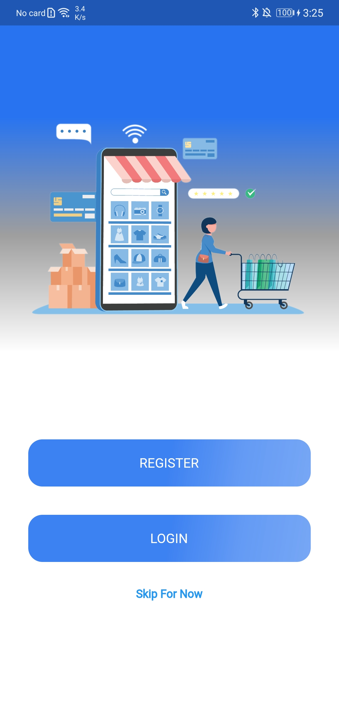
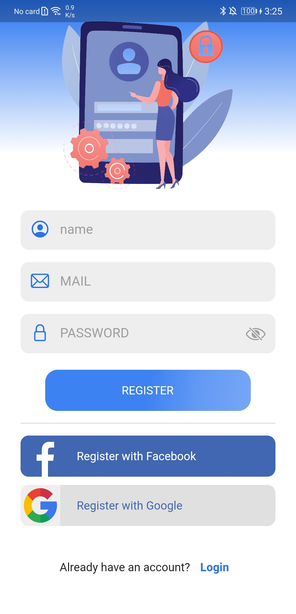
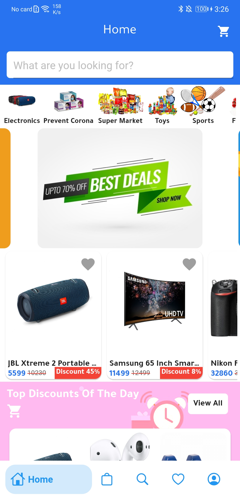
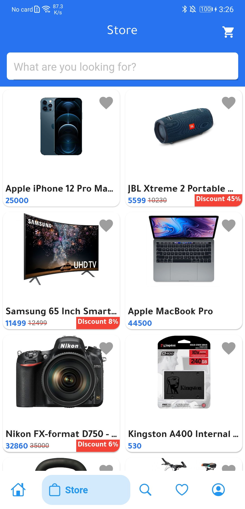
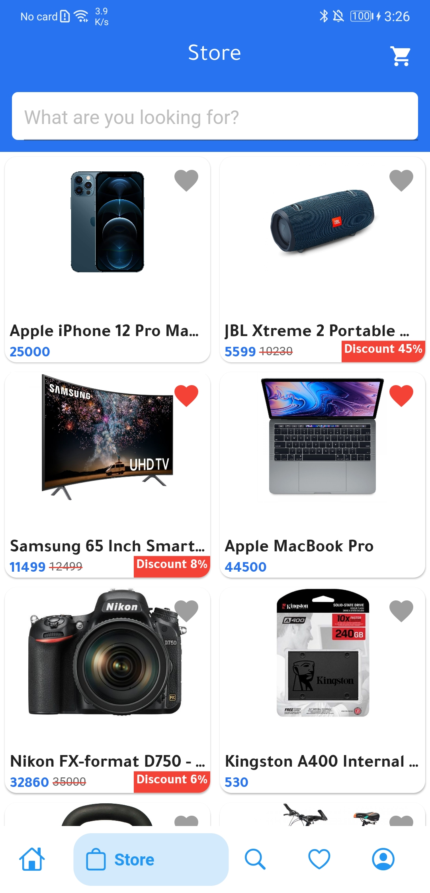
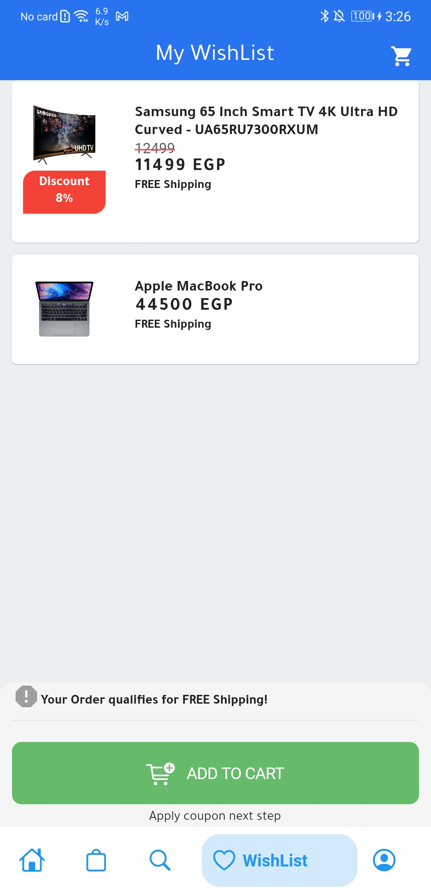
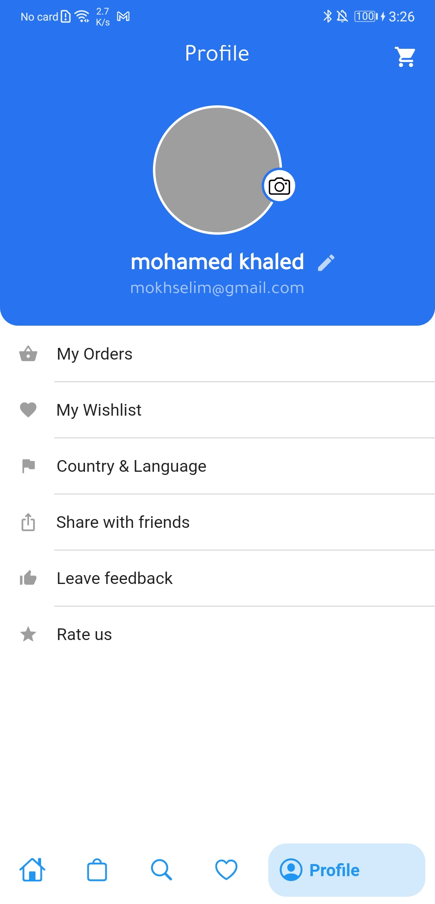
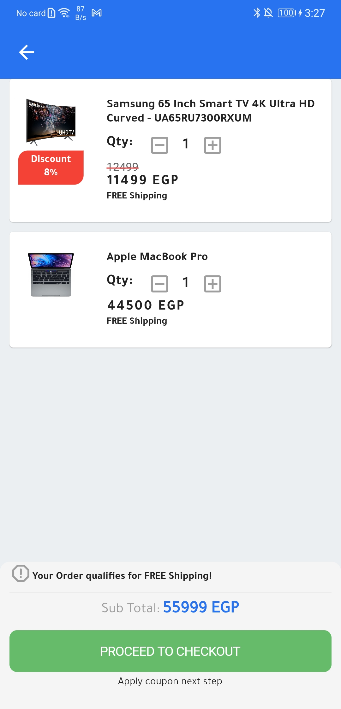

# shopin

ShopIn is an Ecommerce app inspired by(FlutterDevs & souq)

## Getting Started

<!-- ### [GooglePlay](https://play.google.com/store/apps/details?id=com.neomomovies.neo_old_movies) 🥇 -->

# Show some :heart: and :star: the repo to support the project

### Screenshots 😳 :star: 

   

   

This project is a starting point for a Flutter application.

A few resources to get you started if this is your first Flutter project:

- [Lab: Write your first Flutter app](https://flutter.dev/docs/get-started/codelab)
- [Cookbook: Useful Flutter samples](https://flutter.dev/docs/cookbook)

For help getting started with Flutter, view our
[online documentation](https://flutter.dev/docs), which offers tutorials,
samples, guidance on mobile development, and a full API reference.
"# ShopApp" 

